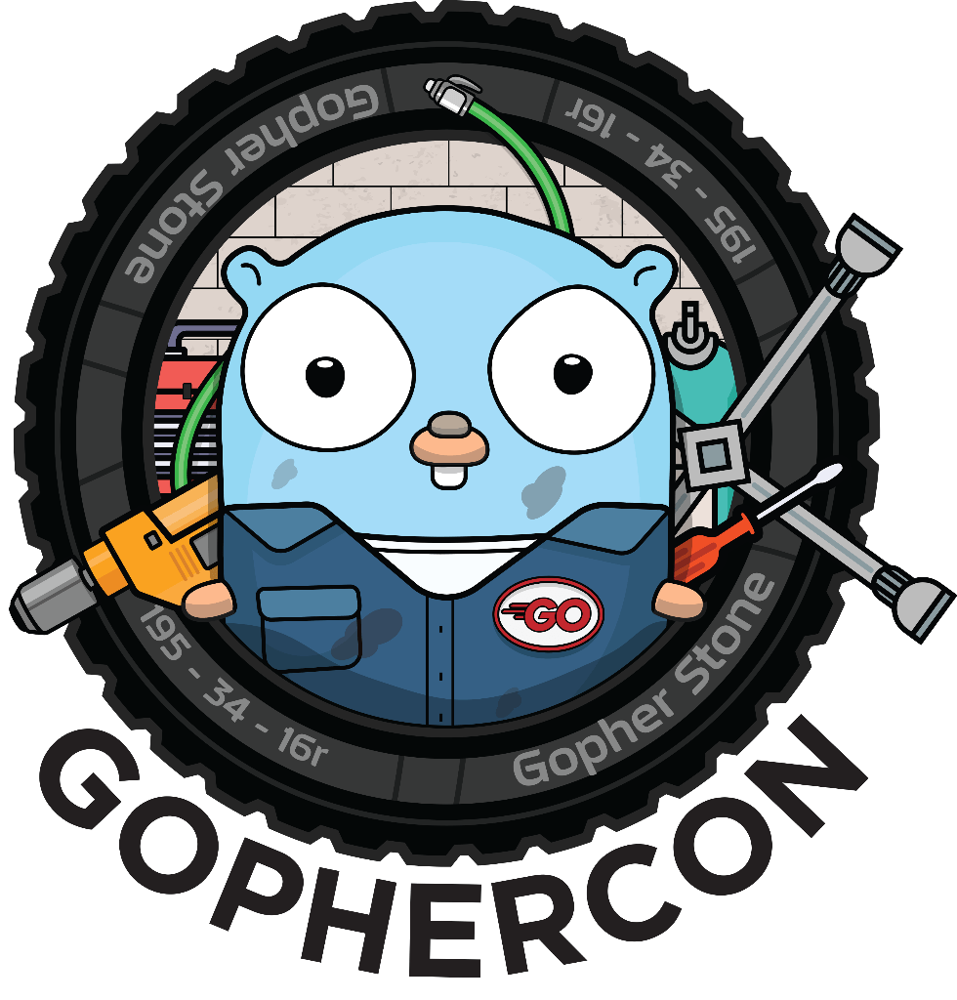

# Gophercon 2018
Tutorials and talks from Gophercon 2018 in Denver, Colorado, USA from August 27-30, 2018.

## Tutorials

### Advanced Ultimate Go
Aarti Parikh [[Twitter](https://twitter.com/classyhacker)] [[LinkedIn](https://www.linkedin.com/in/aartiparikh/)]

William Kennedy [[Twitter](https://twitter.com/goinggodotnet)] [[LinkedIn](https://www.linkedin.com/in/william-kennedy-5b318778/)]

- Presentation

### Architecture & Domain Modeling with Go Kit
Peter Bourgon [[Twitter](https://twitter.com/peterbourgon)] [[LinkedIn](https://www.linkedin.com/in/peterbourgon/)]

- Presentation

### Cloud-native Go
Josh Gavant [[Twitter](https://twitter.com/joshugav)] [[LinkedIn](https://www.linkedin.com/in/joshgav/)]

Martin Strobel [[Twitter](https://twitter.com/mkstrobel)] [[LinkedIn](https://www.linkedin.com/in/martin-strobel-9b005720/)]

- Presentation

### Go Beginners' Training
Johnny Boursiquot [[Twitter](https://twitter.com/jboursiquot)] [[LinkedIn](https://www.linkedin.com/in/jboursiquot/)]

Carolyn Van Slyck [[Twitter](https://twitter.com/carolynvs)] [[LinkedIn](https://www.linkedin.com/in/vanslyck/)]

- Presentation

### Maching Learning
Diana Ortega [[Twitter](https://twitter.com/dicaormu)] [[LinkedIn](https://www.linkedin.com/in/diana-ortega-727711a/)]

Daniel Whitenack [[Twitter](https://twitter.com/dwhitena)] [[LinkedIn](https://www.linkedin.com/in/danielwhitenack/)]

- [Presentation](https://github.com/ardanlabs/training-ai/tree/master/machine-learning-with-go)

### Performance Tuning
Dave Cheney [[Twitter](https://twitter.com/davecheney)]

Francesc Campoy Flores [[Twitter](https://twitter.com/francesc)] [[LinkedIn](https://www.linkedin.com/in/campoy/)]

- [Presentation](https://github.com/davecheney/gophercon2018-performance-tuning-workshop)

### Testing
Mat Ryer [[Twitter](https://twitter.com/matryer)] [[LinkedIn](https://www.linkedin.com/in/matryer/)]

- Presentation

### Web Development
Mark Bates [[Twitter](https://twitter.com/markbates)] [[LinkedIn](https://www.linkedin.com/in/markbates2/)]

- [Presentation](https://www.gopherguides.com/courses/workshops-gophercon-2018-buffalo-workshop)

## Talks

### The Scheduler Saga
Kavya Joshi [[Twitter](https://twitter.com/kavya719)] [[LinkedIn](https://www.linkedin.com/in/kavyajoshi/)]

- [Presentation](https://speakerdeck.com/kavya719/the-scheduler-saga)
- [Live Blog](https://about.sourcegraph.com/go/gophercon-2018-the-scheduler-saga)
- Video

### An Over-Engineering Disaster with Macaroons
Tess Rinearson [[Twitter](https://twitter.com/_tessr)] [[LinkedIn](https://www.linkedin.com/in/temiri/)]

- [Presentation](https://speakerdeck.com/tessr/an-over-engineering-disaster-with-macaroons)
- [Live Blog](https://about.sourcegraph.com/go/gophercon-2018-an-over-engineering-disaster-with-macaroons)
- Video

### Go for Information Displays
Anthony Starks [[Twitter](https://twitter.com/ajstarks)] [[LinkedIn](https://www.linkedin.com/in/ajstarks/)]

- [Presentation](https://speakerdeck.com/ajstarks/go-for-information-displays-gophercon-edition)
- [Live Blog](https://about.sourcegraph.com/go/gophercon-2018-go-for-information-displays)
- Video

### Machine Learning on Go Code
Francesc Campoy Flores [[Twitter](https://twitter.com/francesc)] [[LinkedIn](https://www.linkedin.com/in/campoy/)]

- [Presentation](https://speakerdeck.com/campoy/machine-learning-on-go-code)
- Video

### Asynchronous Networking Patterns
Filippo Valsorda [[Twitter](https://twitter.com/FiloSottile)]

- [Presentation](https://speakerdeck.com/filosottile/asynchronous-networking-at-gophercon-2018)
- [Live Blog](https://about.sourcegraph.com/go/gophercon-2018-asynchronous-networking-patterns)
- Video

### How Do You Structure Your Go Apps?
Kat Zien [[Twitter](https://twitter.com/kasiazien)] [[LinkedIn](https://www.linkedin.com/in/katzien/)]

- [Presentation](https://github.com/katzien/talks/blob/master/how-do-you-structure-your-go-apps/gophercondenver-2018-08-28/slides.pdf)
- [Live Blog](https://about.sourcegraph.com/go/gophercon-2018-how-do-you-structure-your-go-apps)
- Video

### Painting with Light
Hunter Loftis [[Twitter](https://twitter.com/hunterloftis)] [[LinkedIn](https://www.linkedin.com/in/hunterloftis/)]

- Presentation
- [Live Blog](https://about.sourcegraph.com/go/gophercon-2018-painting-with-light)
- Video

### Allocator Wrestling
Eben Freeman [[Twitter](https://twitter.com/_emfree_)]

- [Presentation](https://speakerdeck.com/emfree/allocator-wrestling)
- [Live Blog](https://about.sourcegraph.com/go/gophercon-2018-allocator-wrestling)
- Video

### Binary Search Tree AlGOrithms
Kaylyn Gibilterra [[Twitter](https://twitter.com/kgibilterra)] [[LinkedIn](https://www.linkedin.com/in/kgibilterra/)]

- [Presentation](https://speakerdeck.com/kgibilterra/sorting-and-searching-algorithms)
- Video

### How to Write a Parser in Go
Sugu Sougoumarane [[Twitter](https://twitter.com/ssougou)] [[LinkedIn](https://www.linkedin.com/in/sugu-sougoumarane-b9bb25/)]

- Presentation
- Video

### Go Says WAT?
Jon Bodner [[Twitter](https://twitter.com/jonbodner)] [[LinkedIn](https://www.linkedin.com/in/jonbodner/)]

- Presentation
- [Live Blog](https://about.sourcegraph.com/go/gophercon-2018-go-says-wat)
- Video

### Rethinking Classical Concurrency Patterns
Bryan C. Mills

- Presentation
- Video

### gRPC, State Machines, and… Testing?
Amy Codes [[Twitter](https://twitter.com/theamycode)] [[LinkedIn](https://www.linkedin.com/in/theamycode/)]

- Presentation
- Video

### Computer Vision Using Go and OpenCV 3
Ron Evans [[Twitter](https://twitter.com/deadprogram)] [[LinkedIn](https://www.linkedin.com/in/deadprogram/)]

- Presentation
- [Live Blog](https://about.sourcegraph.com/go/gophercon-2018-computer-vision-using-go-and-opencv-3)
- Video

### Writing Accessible Go
Julia Ferraioli [[Twitter](https://twitter.com/juliaferraioli)] [[LinkedIn](https://www.linkedin.com/in/juliaferraioli/)]

- [Presentation](https://docs.google.com/document/d/1AsktP9tHph4a714YPoVtWOJ0QCb6eckh-2VtHpYSC6s/edit)
- Video

### Going Serverless
Kelsey Hightower [[Twitter](https://twitter.com/kelseyhightower)]

- Presentation
- Video

### Go in Debian
Michael Stapelberg [[Twitter](https://twitter.com/zekjur)]

- [Presentation](https://docs.google.com/presentation/d/1W0xjmh85A8DoGvQa2-MrLayyEec7ivArCus1YvruHiI/edit#slide=id.p)
- Video

### Becoming a Go Contributor
Kevin Burke [[Twitter](https://twitter.com/derivativeburke)] [[LinkedIn](https://www.linkedin.com/in/ekrub/)]

- [Presentation](https://kev.inburke.com/slides/becoming-go-contributor/)
- Video

### From Prototype to Production: Lessons from building and scaling Reddit’s Ad Serving Platform
Deval Shah [[Twitter](https://twitter.com/devalshah)] [[LinkedIn](https://www.linkedin.com/in/deval-shah-0aa1a82a/)]

- Presentation
- [Live Blog](https://about.sourcegraph.com/go/gophercon-2018-from-prototype-to-production-lessons-from-building-and/)
- Video

### Micro-optimizing Go Code
George Tankersley [[Twitter](https://twitter.com/gtank__)]

- Presentation
- [Live Blog](https://about.sourcegraph.com/go/gophercon-2018-micro-optimizing-go-code/)
- Video

### The Go Programmer's Guide to Secure Connections
Liz Rice [[Twitter](https://twitter.com/lizrice)] [[LinkedIn](https://www.linkedin.com/in/lizrice/)]

- [Presentation](https://speakerdeck.com/lizrice/a-go-programmers-guide-to-secure-connections)
- Video

### 5 Mistakes C/C++ Devs Make While Writing Go
Nyah Check [[Twitter](https://twitter.com/nyah_check)] [[LinkedIn](https://www.linkedin.com/in/nyahcheck/)]

- [Presentation](https://speakerdeck.com/ch3ck/c-plus-plus-devs-make-writing-go)
- [Live Blog](https://about.sourcegraph.com/go/gophercon-2018-5-mistakes-c-c-devs-make-writing-go/)
- Video

### Designing Software Within Constraints: Building to a Specification
Kris Brandow [[Twitter](https://twitter.com/skriptble)] [[LinkedIn](https://www.linkedin.com/in/kristoferbrandow/)]

- Presentation
- Video

### gRPC reflection and grpcurl
Joshua Humphries [[LinkedIn](https://www.linkedin.com/in/jhumphries131/)]

- Presentation
- Video

### Adventures in Cgo Performance
Sean T. Allen [[Twitter](https://twitter.com/SeanTAllen)] [[LinkedIn](https://www.linkedin.com/in/seantallen/)]

- [Presentation](https://github.com/SeanTAllen/adventures-in-cgo-performance)
- [Live Blog](https://about.sourcegraph.com/go/gophercon-2018-adventures-in-cgo-performance/)
- Video

### C L Eye-Catching User Interfaces
James Bowes [[Twitter](https://twitter.com/jrbowes)] [[LinkedIn](https://www.linkedin.com/in/jbowes/)]

- [Presentation](https://github.com/jbowes/cl-eye-catching-uis)
- [Live Blog](https://about.sourcegraph.com/go/gophercon-2018-c-l-eye-catching-user-interfaces/)
- Video

### Implementing a Network Protocol in Go
Matt Layher [[Twitter](https://twitter.com/mdlayher)]

- [Presentation](https://github.com/mdlayher/talks/tree/master/gophercon2018)
- [Live Blog](https://about.sourcegraph.com/go/gophercon-2018-implementing-a-network-protocol-in-go/)
- Video

### The Importance of Beginners
Natalie Pistunovich [[Twitter](https://twitter.com/nataliepis)] [[LinkedIn](https://www.linkedin.com/in/nataliepistunovich/)]

- Presentation
- Video

## Contributing
If you have the link to a presentation or Sourcegraph live blog that is not currently included, please feel free to open a PR.

I will add videos once they are up, which should be 1-2 weeks after the conference.
